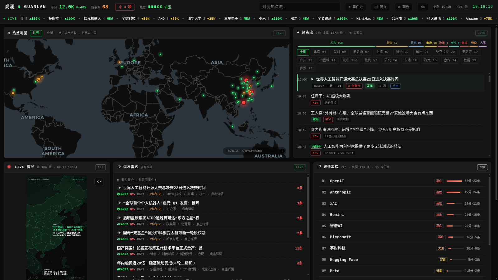
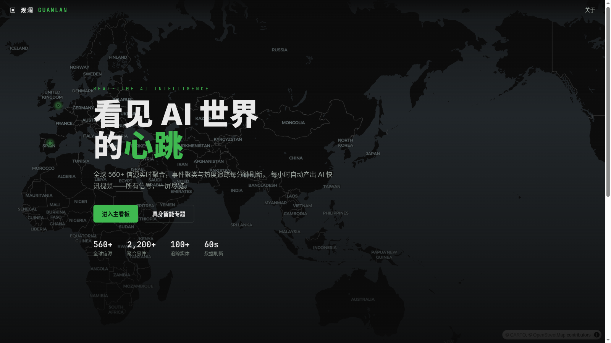
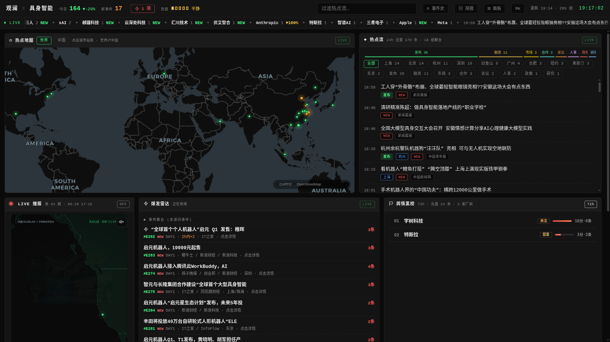
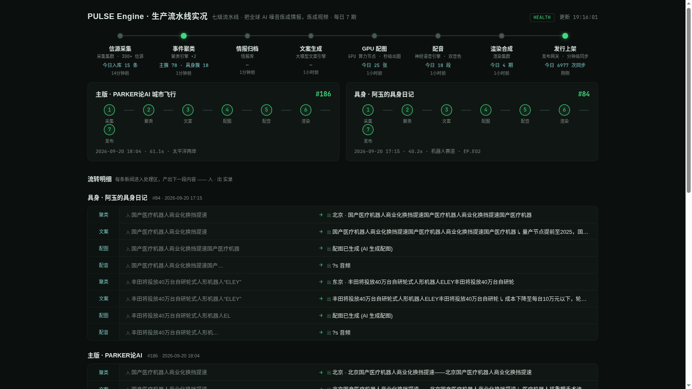
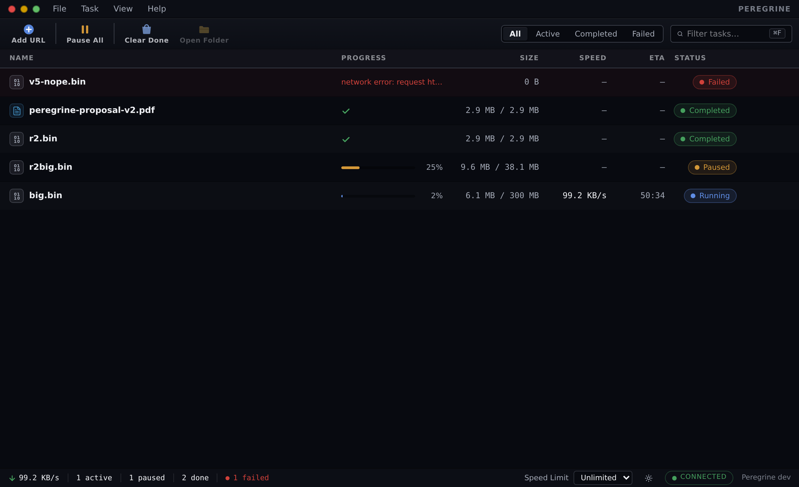
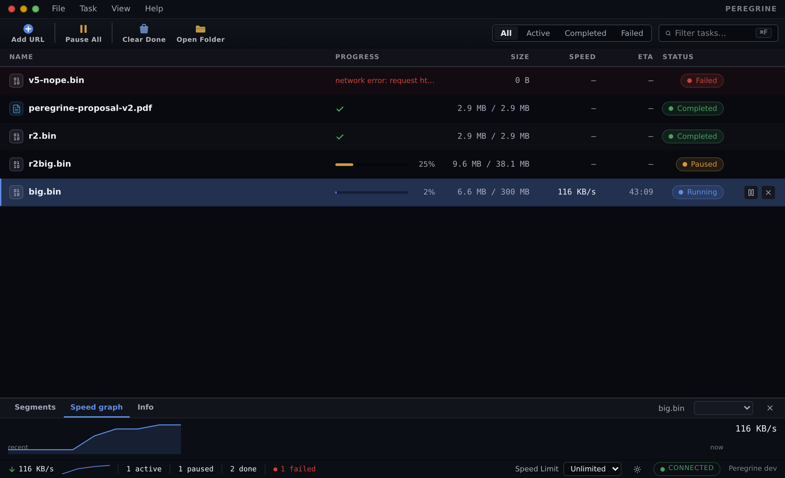
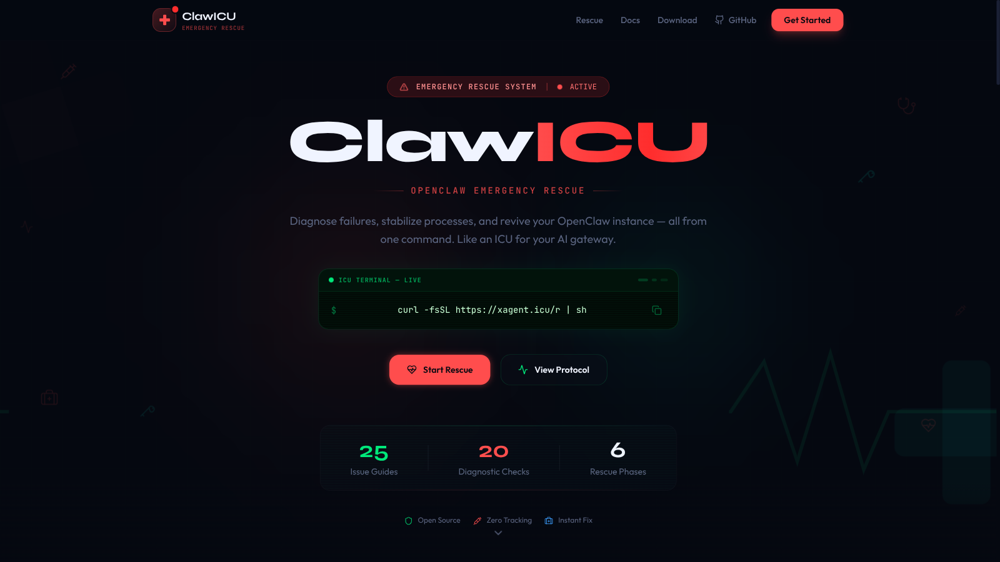

<div align="center">

<!-- ═══════════ HERO（观澜式：kicker → 大标题 → 一句话） ═══════════ -->

`SYSTEM ONLINE` · `REAL-TIME AI INTELLIGENCE` · `EST. 2026`

# Hi, I'm Parker <a href="https://pmparker.net/">(PM Parker)</a> 🛰️

**十年产品经理（百度系），现在把 AI 当团队用，一个人跑一条产品线。**

从下载内核（Rust）到 Agent 中间件（工作流/记忆/运维），再到应用层（情报看板/自动视频产线）——
**每个项目都是活的：有线上地址、有真实数据、有踩坑复盘。**

<a href="https://pmparker.net/"></a>
<a href="https://wen.pmparker.net/"></a>
<a href="https://xagent.icu/"></a>
<a href="mailto:yunjiemi@agent.qq.com"></a>

<br/>
<br/>

<!-- ═══════════ 头图：观澜主看板 ═══════════ -->

<a href="https://wen.pmparker.net/radar.html">
  
</a>

### 📡 观澜 GUANLAN — 看见 AI 世界的心跳

**跑在自己 NAS 上的生产级情报系统，7×24 无人值守。**

<br/>

| **560+** | **2,200+** | **100+** | **60s** | **12 期/日** | **0.024 ¥/图** |
|:---:|:---:|:---:|:---:|:---:|:---:|
| 全球信源 | 聚合事件 | 追踪实体 | 数据刷新 | 全自动视频 | AI 配图成本 |

</div>

<br/>

<!-- ═══════════ 系统分层 ═══════════ -->

## 🏗️ The System — 不是一堆 repo，是一套系统

```text
📡 应用层   观澜 GUANLAN（情报看板 · 12期/日全自动视频）    ClawICU Site（运维知识库）
──────────────────────────────────────────────────────────────
🧠 中间件   SoloFlow（工作流引擎）   LobsterPress（认知记忆）   ClawICU（急救系统）
──────────────────────────────────────────────────────────────
⚙️ 基础层   Peregrine（下载内核）    OpenClaw Portable（便携运行时）
```

<br/>

<!-- ═══════════ 观澜：四屏联动 ═══════════ -->

## 📡 观澜 GUANLAN · 产品矩阵

<div align="center">

**全球 560+ 信源实时聚合 · 事件聚类与热度追踪 · 每小时 AI 快讯视频 · 具身智能垂直频道**

<a href="https://wen.pmparker.net/radar.html"></a>
<a href="https://wen.pmparker.net/embodied.html"></a>

<a href="https://wen.pmparker.net/pulse/factory.html"></a>


<p><sub>左上：信源地图首页 · 右上：具身智能频道 · 左下：PULSE 流水线实况 · 右下：Peregrine GUI</sub></p>

**🔥 产线实况**：每期视频全自动 —— 选稿 → LLM 文案 → GPU 配图（3.2s/张）→ TTS → 渲染 → 发布。
从新闻入库到视频发布**零人工介入**，[架构复盘写在博客里](https://pmparker.net/blog/pulse-engine-video-pipeline.html)。

</div>

<br/>

<!-- ═══════════ 项目卡 ═══════════ -->

## ⚡ Featured Projects

### 🦅 [Peregrine](https://github.com/SonicBotMan/peregrine) — Linux 下载器 `Rust` `Tauri 2` `最新`

> 游隼——俯冲时速 389 km/h 的地球最快动物。

<a href="https://github.com/SonicBotMan/peregrine"></a>

- 自研 Rust 内核：IDM 式分段下载 + **动态重平衡**，慢链路实测 **3.1× 加速**；`kill -9` 级断点续传
- **MCP 一等公民**：Claude / 任意 Agent 直接管理下载（10 工具 · 3 类资源 · 实时事件）
- headless daemon：CLI / GUI / MCP 三端薄客户端同构，协议即插件

<br/>

### 🏥 [ClawICU](https://github.com/SonicBotMan/clawicu) — OpenClaw 急救系统 `Shell` → [xagent.icu](https://xagent.icu/)

<a href="https://xagent.icu/"></a>

- 一条命令：**20** 项诊断 → **6** 阶段救援协议 → 自动修复（支持 `curl | sh`）
- **25** 篇线上故障指南，Next.js 静态站 + SEO + SOS 分享页

<br/>

### ⚡ [SoloFlow](https://github.com/SonicBotMan/SoloFlow) — AI Agent 工作流引擎  `Python`

> 把多步 AI 任务变成结构化、可观测、可重试的工作流——再让引擎自己学会重复模式。

- **DAG + FSM** 双引擎：依赖排序、并行执行、状态机校验
- 三层记忆：Working (LRU) / Episodic (SQLite FTS5) / Semantic（模板）
- **Skill Evolution**：观察 → 检测 → 打包 → 评分 → 安装
- **96 tests passing · 零运行时依赖**

<br/>

### 🦞 [LobsterPress](https://github.com/SonicBotMan/lobster-press) — Agent 认知记忆引擎   `Python`

> 滑动窗口会永久丢上下文。LobsterPress 把每轮对话存进本地 SQLite，用认知科学策略管理记忆。

- **DAG 无损压缩 + 遗忘曲线 + 语义笔记**
- SQLite 单文件 · 零向量库依赖 · 原始消息永不删除，任何摘要可回溯

<br/>

### 🔌 [openclaw-portable](https://github.com/SonicBotMan/openclaw-portable) — 便携式 OpenClaw 

即插即用，插在 Windows / Linux / Mac 上就能跑，开箱即用。

<br/>

<!-- ═══════════ 写作 ═══════════ -->

## ✍️ Writing — 每篇文章背后都有真实项目与数据

| 文章 | 讲什么 |
|------|--------|
| [我让 AI 建了条视频产线，它把我首页覆盖了](https://pmparker.net/blog/pulse-engine-video-pipeline.html) | 12期/日产线：三次鬼、8.18GB 无限混音、尾斜杠覆盖首页 |
| [从新闻标题到封面图：3.2 秒的 AI 配图管线](https://pmparker.net/blog/ai-cover-pipeline.html) | 九段式 Prompt 工程 + GPU 容器农场 + 成本分析 |
| [最可怕的不是报错，是你的 AI 悄悄换了个人](https://pmparker.net/blog/silent-degradation.html) | 静默降级：配置里的模型不是跑着的模型 |
| [4090 大战 Jetson Thor](https://pmparker.net/blog/gpu-benchmark-4090-thor.html) | 同 seed 生图基准测试，差距没想到 |
| [我的第二大脑终于能用了](https://pmparker.net/blog/second-brain-engineering.html) | 把记忆系统当产品做：写入纪律、受控词表、分层召回 |

**[全部 29 篇 →](https://pmparker.net/blog/)**

<br/>

<!-- ═══════════ 其他 ═══════════ -->

<details>
<summary><b>🛠️ More Projects</b></summary>

| Project | Description |
|---------|-------------|
| [dsv4-dual-thor-tuning](https://github.com/SonicBotMan/dsv4-dual-thor-tuning) | DeepSeek-V4-Flash 双 Jetson Thor 生产级调优 |
| [dsv4-vision-thor-port](https://github.com/SonicBotMan/dsv4-vision-thor-port) | DeepSeek-V4 Vision 在 Thor (SM110) 上的适配 |
| [dating-skills](https://github.com/SonicBotMan/dating-skills) | 恋爱方法论蒸馏技能包 😄 |
| [labor-rights-defense](https://github.com/SonicBotMan/labor-rights-defense) | 劳动维权方法论 AI Agent 技能包（2025 司法解释二 + 2026 判例） |
| [resume-forge](https://github.com/SonicBotMan/resume-forge) | AI 简历锻造工坊——产品经理专属 |

</details>

<br/>

<!-- ═══════════ 英文摘要 ═══════════ -->

<details>
<summary><b>🌐 English Summary</b></summary>

Ten-year product manager (Baidu alum), now building AI products full-time — treating AI as the team. The portfolio spans the full stack: **Peregrine** (Rust multi-segment download kernel with native MCP agent scheduling, 3.1× acceleration), **SoloFlow** (DAG+FSM workflow engine with three-tier memory and automatic skill evolution), **LobsterPress** (cognitive memory engine — single SQLite file, zero vector DB), **ClawICU** (OpenClaw emergency rescue: 20 checks, 6 phases, 25 guides), and **观澜 GUANLAN** — a live intelligence system on my home NAS tracking 560+ sources with a fully automated video pipeline producing 12 AI-narrated episodes per day. I write deep-dive articles (in Chinese) at [pmparker.net](https://pmparker.net/).

</details>

<br/>

<div align="center">


<a href="https://github.com/SonicBotMan?tab=repositories"></a>

<br/>

`SYSTEM STATUS: ALL GREEN` 🟢

</div>
